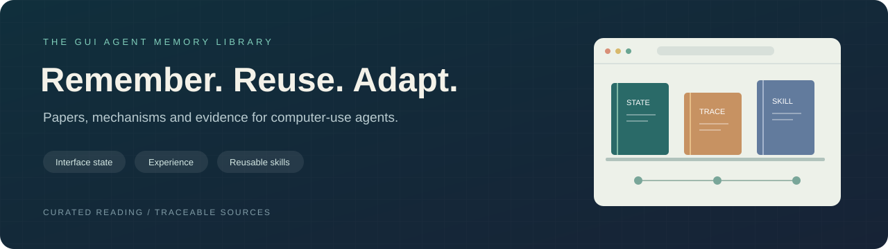

<div align="center">



# Awesome GUI Agent Memory

### A reading library for agents that remember

Curated papers, mechanism guides and traceable evidence on memory for GUI and computer-use agents.

**English** · [简体中文](README.zh-CN.md)

[Start Here](#start) · [Paper Library](#shelves) · [Benchmarks](#benchmarks) · [Our Survey](#survey) · [Evidence](#evidence)

**Paper — Coming soon** · **30 curated readings** · **Evidence coverage through 2026-09-10**

</div>

---

<a id="start"></a>

## 🧭 Start Here

| Reading goal | Suggested route |
|---|---|
| Get oriented | [Related surveys](#surveys) → [Our framework](#survey) |
| Understand information retention in long tasks | [Task state & visual history](#state): ATMem → PAL-UI → MementoGUI |
| Explore reuse across tasks | [Trajectories & experience](#experience): Synapse → Agent S → [Workflows & skills](#skills): AWM |
| Study memory reliability | [Maintenance & safety](#maintenance): HYMEM → Darwinian Memory → VerificAgent |
| Design an evaluation or check a claim | [Benchmarks](#benchmarks) → [Fixed evidence package](#evidence) |

<a id="shelves"></a>

## 📚 Paper Library

These shelves are reading guides; lifecycle and state-object assignments live in the evidence matrix. This selection draws on the existing evidence collection. Library inclusion and formal coding are maintained separately, with fixed evidence versions recording the basis and scope of individual claims.

[🖥️ Task State & Visual History](#state) · [🧭 Trajectories & Experience](#experience) · [🛠️ Workflows & Skills](#skills) · [👤 User Preferences & Task Information](#personalization) · [🔄 Maintenance & Memory Safety](#maintenance) · [🧪 Benchmarks & Evaluation](#benchmarks) · [📖 Related Surveys](#surveys)

<a id="state"></a>

### 🖥️ Task State & Visual History

Keeping the information needed for the next action.

**ATMem** · 2026<br>
[What Memory Do GUI Agents Really Need? From Passive Records to Active Task-Driving States](https://arxiv.org/abs/2606.31612v2)<br>
Organizes task data as execution state, separating data applicability, workflow progress and remaining operations.<br>
[Evidence: PC-016](https://github.com/kqcoxn/gui-memory-evidence/blob/evidence-20260913-r4.19/releases/evidence-20260913-r4.19/current/claims.json#L375)

**PAL-UI** · 2025<br>
[PAL-UI: Planning with Active Look-back for Vision-Based GUI Agents](https://arxiv.org/abs/2510.00413v2)<br>
Retrieves a previous screenshot by step index when the agent needs to look back.<br>
[Evidence: PC-003](https://github.com/kqcoxn/gui-memory-evidence/blob/evidence-20260913-r4.19/releases/evidence-20260913-r4.19/current/claims.json#L54)

**Chain-of-Memory** · 2025<br>
[Chain-of-Memory: Enhancing GUI Agents for Cross-Application Navigation](https://arxiv.org/abs/2506.18158v1)<br>
Bounds recent action results in short-term memory; task-relevant screen information is selected into long-term memory (PC-002).<br>
[Evidence: PC-001](https://github.com/kqcoxn/gui-memory-evidence/blob/evidence-20260913-r4.19/releases/evidence-20260913-r4.19/current/claims.json#L3)

**MementoGUI** · 2026<br>
[MementoGUI: Learning Agentic Multimodal Memory Control for Long-Horizon GUI Agents](https://arxiv.org/abs/2605.18652v1)<br>
Keeps selected events as text summaries and image regions for later action decisions.<br>
[Evidence: PC-013](https://github.com/kqcoxn/gui-memory-evidence/blob/evidence-20260913-r4.19/releases/evidence-20260913-r4.19/current/claims.json#L298)

**CausalCache** · 2026<br>
[CausalCache: Conditional High-Fidelity Restoration for Long-Horizon GUI Agents](https://arxiv.org/abs/2608.22577v2)<br>
Restores selected summarized events to text-and-image form within a fixed active-image budget.<br>
[Evidence: PC-015](https://github.com/kqcoxn/gui-memory-evidence/blob/evidence-20260913-r4.19/releases/evidence-20260913-r4.19/current/claims.json#L351)

**Mem-W** · 2026<br>
[Mem-W: Latent Memory-Native GUI Agents](https://arxiv.org/abs/2605.09317v1)<br>
Compresses past experience and aging context prefixes into latent memory blocks for a frozen GUI policy.<br>
[Evidence: PC-012](https://github.com/kqcoxn/gui-memory-evidence/blob/evidence-20260913-r4.19/releases/evidence-20260913-r4.19/current/claims.json#L274)

[↑ Back to shelves](#shelves)

<a id="experience"></a>

### 🧭 Trajectories & Experience

Learning reusable guidance from previous interactions.

**Synapse** · 2023<br>
[Synapse: Trajectory-as-Exemplar Prompting with Memory for Computer Control](https://arxiv.org/abs/2306.07863v3)<br>
Retrieves exemplar trajectories through task metadata; its Mind2Web exemplar pool uses the training split.<br>
[Code](https://github.com/ltzheng/Synapse) · [Evidence: PC-041](https://github.com/kqcoxn/gui-memory-evidence/blob/evidence-20260913-r4.19/releases/evidence-20260913-r4.19/current/claims.json#L979)

**Agent S** · 2024<br>
[Agent S: An Open Agentic Framework that Uses Computers Like a Human](https://arxiv.org/abs/2410.08164v1)<br>
Retrieves successful subtask experience and writes strategy summaries back after completion.<br>
[Code](https://github.com/simular-ai/Agent-S) · [Evidence: PC-044](https://github.com/kqcoxn/gui-memory-evidence/blob/evidence-20260913-r4.19/releases/evidence-20260913-r4.19/current/claims.json#L1056)

**ReasoningBank** · 2025<br>
[ReasoningBank: Scaling Agent Self-Evolving with Reasoning Memory](https://arxiv.org/abs/2509.25140v2)<br>
Stores structured lessons extracted from successful and failed experiences.<br>
[Evidence: PC-035](https://github.com/kqcoxn/gui-memory-evidence/blob/evidence-20260913-r4.19/releases/evidence-20260913-r4.19/current/claims.json#L834)

**WebCoach** · 2025<br>
[WebCoach: Self-Evolving Web Agents with Cross-Session Memory Guidance](https://arxiv.org/abs/2511.12997v2)<br>
Stores complete trajectory summaries after termination and retrieves experience from partial trajectories during execution.<br>
[Evidence: PC-011](https://github.com/kqcoxn/gui-memory-evidence/blob/evidence-20260913-r4.19/releases/evidence-20260913-r4.19/current/claims.json#L249)

[↑ Back to shelves](#shelves)

<a id="skills"></a>

### 🛠️ Workflows & Skills

Turning interaction history into reusable procedures.

**Agent Workflow Memory** · 2024<br>
[Agent Workflow Memory](https://arxiv.org/abs/2409.07429v1)<br>
Abstracts subtask workflows from experience, replacing instance values with parameters to guide action generation.<br>
[Code](https://github.com/zorazrw/agent-workflow-memory) · [Evidence: PC-034](https://github.com/kqcoxn/gui-memory-evidence/blob/evidence-20260913-r4.19/releases/evidence-20260913-r4.19/current/claims.json#L809)

**ActionEngine** · 2026<br>
[ActionEngine: From Reactive to Programmatic GUI Agents via State Machine Memory](https://arxiv.org/abs/2602.20502v1)<br>
Records UI state transitions and retains selector-based access patterns for dynamic content.<br>
[Evidence: PC-017](https://github.com/kqcoxn/gui-memory-evidence/blob/evidence-20260913-r4.19/releases/evidence-20260913-r4.19/current/claims.json#L400)

**State-Grounded Dynamic Retrieval** · 2026<br>
[Online Skill Learning for Web Agents via State-Grounded Dynamic Retrieval](https://arxiv.org/abs/2606.04391v1)<br>
Extracts local skills from trajectory windows and verifies them by substitution and re-execution.<br>
[Evidence: PC-021](https://github.com/kqcoxn/gui-memory-evidence/blob/evidence-20260913-r4.19/releases/evidence-20260913-r4.19/current/claims.json#L503)

**AppAgent** · 2023<br>
[AppAgent: Multimodal Agents as Smartphone Users](https://arxiv.org/abs/2312.13771v3)<br>
Builds and updates UI-element documentation from exploration, then supplies page-specific guidance during deployment.<br>
[Code](https://github.com/TencentQQGYLab/AppAgent) · [Evidence: PC-042](https://github.com/kqcoxn/gui-memory-evidence/blob/evidence-20260913-r4.19/releases/evidence-20260913-r4.19/current/claims.json#L1005)

[↑ Back to shelves](#shelves)

<a id="personalization"></a>

### 👤 User Preferences & Task Information

Reusing user context with an explicit scope.

**PersonaTrail / PACMEM** · 2026<br>
[PersonaTrail: Benchmarking Personalized Web Agents through Browsing Trails](https://arxiv.org/abs/2607.20482v2)<br>
Separates factual and preference memory from browsing history, combining semantic and temporal retrieval cues.<br>
[Evidence: PC-022](https://github.com/kqcoxn/gui-memory-evidence/blob/evidence-20260913-r4.19/releases/evidence-20260913-r4.19/current/claims.json#L529)

**PersonalAlign / HIM-Agent** · 2026<br>
[PersonalAlign: Hierarchical Implicit Intent Alignment for Personalized GUI Agent with Long-Term User-Centric Records](https://arxiv.org/abs/2601.09636v2)<br>
Aggregates GUI user records into prototypes and updates hierarchical preference and routine-intent memory daily.<br>
[Evidence: PC-025](https://github.com/kqcoxn/gui-memory-evidence/blob/evidence-20260913-r4.19/releases/evidence-20260913-r4.19/current/claims.json#L602)

**MemAgent** · 2025<br>
[MemAgent: A cache-inspired framework for augmenting conversational Web Agents with task-specific information](https://ceur-ws.org/Vol-4028/paper8.pdf)<br>
Separates task-information collection from execution and gives cached task entities an expiration policy.<br>
[Evidence: PC-024](https://github.com/kqcoxn/gui-memory-evidence/blob/evidence-20260913-r4.19/releases/evidence-20260913-r4.19/current/claims.json#L575)

[↑ Back to shelves](#shelves)

<a id="maintenance"></a>

### 🔄 Maintenance & Memory Safety

Updating useful memories and handling stale or harmful content.

**HYMEM** · 2026<br>
[Hybrid Self-evolving Structured Memory for GUI Agents](https://arxiv.org/abs/2603.10291v1)<br>
Chooses ADD, MERGE or REPLACE after retrieving neighboring experience nodes and checking redundancy.<br>
[Evidence: PC-009](https://github.com/kqcoxn/gui-memory-evidence/blob/evidence-20260913-r4.19/releases/evidence-20260913-r4.19/current/claims.json#L198)

**Darwinian Memory** · 2026<br>
[Darwinian Memory: A Training-Free Self-Regulating Memory System for GUI Agent Evolution](https://arxiv.org/abs/2601.22528v1)<br>
Uses utility, time decay and execution-verification penalties to regulate retention and pruning.<br>
[Evidence: PC-008](https://github.com/kqcoxn/gui-memory-evidence/blob/evidence-20260913-r4.19/releases/evidence-20260913-r4.19/current/claims.json#L175)

**PANDO** · 2026<br>
[PANDO: Efficient Multimodal AI Agents via Online Skill Distillation](https://arxiv.org/abs/2605.24785v2)<br>
Retrieves rules and programmatic skills with keywords and persistently downgrades repeatedly failing skills.<br>
[Evidence: PC-020](https://github.com/kqcoxn/gui-memory-evidence/blob/evidence-20260913-r4.19/releases/evidence-20260913-r4.19/current/claims.json#L478)

**VerificAgent** · 2025<br>
[VerificAgent: Domain-Specific Memory Verification for Scalable Oversight of Aligned Computer-Use Agents](https://arxiv.org/abs/2506.02539v3)<br>
Uses expert-checked trajectory lessons, with memory frozen during test inference.<br>
[Evidence: PC-005](https://github.com/kqcoxn/gui-memory-evidence/blob/evidence-20260913-r4.19/releases/evidence-20260913-r4.19/current/claims.json#L102)

**Environment-injected memory poisoning** · 2026<br>
[Poison Once, Exploit Forever: Environment-Injected Memory Poisoning Attacks on Web Agents](https://arxiv.org/abs/2604.02623v2)<br>
Studies how webpage content can poison saved trajectories and influence later tasks through recall.<br>
[Evidence: PC-031](https://github.com/kqcoxn/gui-memory-evidence/blob/evidence-20260913-r4.19/releases/evidence-20260913-r4.19/current/claims.json#L745)

[↑ Back to shelves](#shelves)

<a id="benchmarks"></a>

### 🧪 Benchmarks & Evaluation

Read the interaction protocol alongside the reported metric.

**MemGUI-Bench · online GUI execution** · 2026<br>
[MemGUI-Bench: Benchmarking Memory of Mobile GUI Agents in Dynamic Environments](https://arxiv.org/abs/2602.06075v3)<br>
Evaluates Android GUI interaction with resets after failure and experience transfer across mirrored task pairs.<br>
[Evidence: PC-053](https://github.com/kqcoxn/gui-memory-evidence/blob/evidence-20260913-r4.19/releases/evidence-20260913-r4.19/current/claims.json#L1268)

**AndroTMem · recorded trajectories** · 2026<br>
[AndroTMem: From Interaction Trajectories to Anchored Memory in Long-Horizon GUI Agents](https://arxiv.org/abs/2603.18429v1)<br>
Evaluates state anchors and dependencies on fixed screenshots and annotated actions from recorded trajectories.<br>
[Evidence: PC-052](https://github.com/kqcoxn/gui-memory-evidence/blob/evidence-20260913-r4.19/releases/evidence-20260913-r4.19/current/claims.json#L1248)

**LongMemEval-V2 · memory question answering** · 2026<br>
[LongMemEval-V2: Evaluating Long-Term Agent Memory Toward Experienced Colleagues](https://arxiv.org/abs/2605.12493v1)<br>
Inserts trajectories sequentially, then evaluates a fixed reader using answer accuracy and query latency.<br>
[Evidence: PC-055](https://github.com/kqcoxn/gui-memory-evidence/blob/evidence-20260913-r4.19/releases/evidence-20260913-r4.19/current/claims.json#L1308)

**MemGym · long-horizon environment** · 2026<br>
[MemGym: a Long-Horizon Memory Environment for LLM Agents](https://arxiv.org/abs/2605.20833v1)<br>
Measures memory gain with the same reasoner while recognizing that memory can change later action distributions.<br>
[Evidence: PC-056](https://github.com/kqcoxn/gui-memory-evidence/blob/evidence-20260913-r4.19/releases/evidence-20260913-r4.19/current/claims.json#L1328)

**Budget-constrained web-agent study** · 2026<br>
[Are Online Skill and Memory Modules Always Worth Their Tokens? A Budget-Constrained Study of Web Agents](https://arxiv.org/abs/2606.15017v2)<br>
Accounts for actor, induction, synthesis, memory, retrieval and verification calls in per-task token costs.<br>
[Evidence: PC-058](https://github.com/kqcoxn/gui-memory-evidence/blob/evidence-20260913-r4.19/releases/evidence-20260913-r4.19/current/claims.json#L1369)

[↑ Back to shelves](#shelves)

<a id="surveys"></a>

### 📖 Related Surveys

Broader perspectives for placing GUI memory in context.

**Memory mechanisms of LLM-based agents** · 2024<br>
[A Survey on the Memory Mechanism of Large Language Model based Agents](https://arxiv.org/abs/2404.13501v1)<br>
A general introduction organized around definitions, sources, forms, operations and evaluation.<br>
[Evidence: PC-059](https://github.com/kqcoxn/gui-memory-evidence/blob/evidence-20260913-r4.19/releases/evidence-20260913-r4.19/current/claims.json#L1389)

**Memory in the Age of AI Agents** · 2025<br>
[Memory in the Age of AI Agents](https://arxiv.org/abs/2512.13564v2)<br>
Organizes agent memory through forms, functions and dynamics.<br>
[Evidence: PC-061](https://github.com/kqcoxn/gui-memory-evidence/blob/evidence-20260913-r4.19/releases/evidence-20260913-r4.19/current/claims.json#L1431)

**LLM-Brained GUI Agents** · 2024<br>
[Large Language Model-Brained GUI Agents: A Survey](https://arxiv.org/abs/2411.18279v12)<br>
Maps GUI-agent components, frameworks, data, models, evaluation and applications.<br>
[Evidence: PC-064](https://github.com/kqcoxn/gui-memory-evidence/blob/evidence-20260913-r4.19/releases/evidence-20260913-r4.19/current/claims.json#L1493)

[↑ Back to shelves](#shelves)

<a id="survey"></a>

## 📘 Our Survey

**Memory for GUI Agents: A Framework Survey of Lifecycles and State Layers**

**Paper — Coming soon.** A public paper link and formal citation will appear here when available.

The survey organizes research around **memory lifecycles × GUI state layers**, connecting retained objects, memory use and maintenance, and evaluation conditions. Compare methods through three reading lenses:

- **What is remembered**: interface information, task state, reusable procedures or user context.
- **How it is used and maintained**: retrieval, updating, verification and retirement.
- **How it is evaluated**: online interaction, recorded trajectories or memory question answering, with their budgets and endpoints.

<a id="evidence"></a>

## 🔎 Evidence & Reproducibility

Fixed version **`evidence-20260913-r4.19`** contains **55 coded sources, 75 claims and 24 mechanism comparisons**, with publication coverage through **2026-09-10**. These counts describe the evidence package, separately from the curated readings above.

- [Package overview](https://github.com/kqcoxn/gui-memory-evidence/blob/evidence-20260913-r4.19/releases/evidence-20260913-r4.19/README.md)
- [Collection & coding methods](https://github.com/kqcoxn/gui-memory-evidence/blob/evidence-20260913-r4.19/releases/evidence-20260913-r4.19/current/evidence_methods.md)
- [Claims & source passages](https://github.com/kqcoxn/gui-memory-evidence/blob/evidence-20260913-r4.19/releases/evidence-20260913-r4.19/current/claims.json)
- [Lifecycle–state matrix](https://github.com/kqcoxn/gui-memory-evidence/blob/evidence-20260913-r4.19/releases/evidence-20260913-r4.19/current/capability_matrix.csv)
- [Source profile](https://github.com/kqcoxn/gui-memory-evidence/blob/evidence-20260913-r4.19/releases/evidence-20260913-r4.19/current/corpus_profile.csv)
- [Mechanism comparisons](https://github.com/kqcoxn/gui-memory-evidence/blob/evidence-20260913-r4.19/releases/evidence-20260913-r4.19/current/mechanism_comparisons.json)
- [Acquisition records](https://github.com/kqcoxn/gui-memory-evidence/blob/evidence-20260913-r4.19/releases/evidence-20260913-r4.19/current/acquisition_records.json)
- [Queries & retrieval records](https://github.com/kqcoxn/gui-memory-evidence/tree/evidence-20260913-r4.19/releases/evidence-20260913-r4.19/baseline/search/)

Check package hashes, counts and record links:

```sh
cd releases/evidence-20260913-r4.19
python3 validate.py
```

[Earlier versions](https://github.com/kqcoxn/gui-memory-evidence/tags) remain available through Git tags. Annotations and excerpts link to original publications; source material retains its applicable rights, and full texts can be accessed through the recorded source links.

## 🤝 Contributing

Suggest a paper, correct a link or improve a reading note through an [issue](https://github.com/kqcoxn/gui-memory-evidence/issues) or pull request. Include the original paper link, a suggested shelf and one or two sentences explaining its relevance to GUI memory; code links should point to author-released implementations. Update both language versions when editing an entry. For evidence corrections, include the claim ID and source passage so the correction can be handled in a new version.

## 🌐 Explore Further

- [GUI Agents Paper List](https://github.com/OSU-NLP-Group/GUI-Agents-Paper-List)
- [LLM-Brained GUI Agents Survey](https://github.com/vyokky/LLM-Brained-GUI-Agents-Survey)
- [From Storage to Experience](https://github.com/FeishuLuo/Evolving-LLM-Agent-Memory-Survey)

---

<div align="center">

**English** · [简体中文](README.zh-CN.md)

From discovering papers to tracing evidence.

</div>
