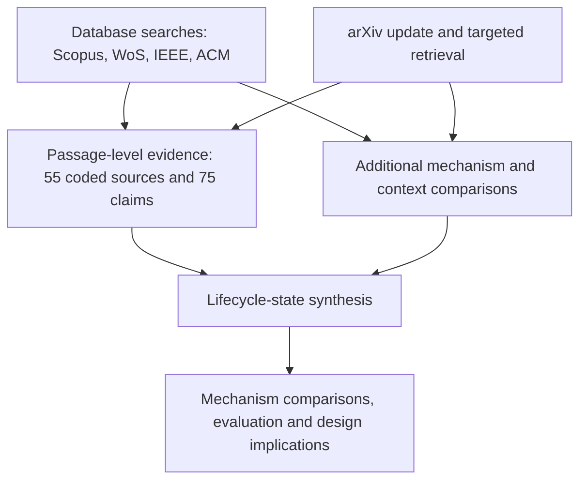

# Evidence collection and coding details
## Acquisition and counting units
Purposive source selection serves contrasts between retained objects, platforms, consumption paths, and maintenance targets. Visual events and interface documentation expose different abstraction choices, while task progress and parameterized workflows expose different reuse boundaries (the manuscript methodology and mechanism sections). Source collection ended on 10 September 2026, with a publication window ending on 8 September 2026, with no prospective saturation threshold or balanced sampling quotas. The candidate dispositions record 113 candidates not selected for claim extraction and eight contextual candidates not selected for core survey comparison; item-specific reasons beyond these categories are unavailable. The supplement identifies the analytical roles, claim identifiers, and supporting passages of the 21 coded sources acquired outside the candidate inventory. These records document their use in the synthesis; their historical screening decisions remain incompletely documented.

The database searches ran on 2--3 September 2026. The accounting table below reports query-hit totals, with overlap across searches, alongside the candidate inventory and coded subset. The Scopus total sums Q1_CORE (74), Q2_PROXY (25), and Q3_EVAL (117); the search example below reproduces Q1_CORE, and the archive records all three literal queries.

The 2015 start and English-language filter follow the preparatory protocol. Their substantive rationale was not documented, and they limit the temporal and linguistic scope of the evidence base.

The accounting table below distinguishes counting units. A study is a separately interpretable experiment or analysis, not a synonym for a reference or matrix cell. Registered source locations can overlap in version or role. Each extracted claim is linked to its source version, page, and supporting passage; related versions of a work are grouped to avoid treating them as independent evidence. Claims are organized by their analytical role (the evidence-role table below). For example, LongMemEval-V2 evaluates historical-context gathering (bibliography keys: `gui_wf_0225`), PersonalWAB uses a function-based environment (bibliography keys: `gui_wf_0339`), and GUI-CC evaluates an environment model (bibliography keys: `gui_add_2609_00048`). These roles determine which conclusions each source can support.

## Coding and verification
Python supported screening, parsing, identity checks, and table generation. The archive provides a Python standard-library validator and the sampling algorithm; the extraction process is only partially reproducible. Source checks used version-specific PDF or HTML text; numerical comparisons were also checked against the source tables and PDF page renderings.

Automated checks verify unique source and claim identifiers, valid layer--operation codes, source-version hashes, resolvable internal citation keys, and arithmetic consistency of extracted contrasts. Extracted claims and numerical comparisons were checked against their supporting passages and reported conditions.
Cell assignment follows the object on which the operation acts, rather than the modality of its inputs. In PAL-UI, before/after screenshots support a judgment about an executed action, recorded here as trajectory verification (L3--V), not verification of the validity of an archived visual record (L1--V). AutoDroid explicitly retrieves UI states and elements from app memory, supporting L2--R. CausalCache reallocates archived images into active context while preserving the archive; this supports L1--R/U, without establishing archival update or expiry (L1--F) (bibliography keys: `gui_wf_0078,gui_add_autodroid,gui_wf_0333`).

### Accounting units

| Unit / set | Count | Meaning and reconciliation |
| --- | --- | --- |
| Query hits | 216/75/13/10 | Scopus / WoS / IEEE / ACM; overlapping hits, not unique records |
| Inventory families | 155 | Linked versions of a work form a family; 34 adopted, 121 not selected |
| Coded sources: route | 55 | 34 inventory families each supply one source; 21 sources are outside that inventory |
| Coded sources: role | 33 + 22 | 33 primary-mechanism families; 22 sources in other roles. This partitions the same 55 by role, not acquisition route |
| Other coded roles | 22 | 10 survey/context, 6 component diagnostic, 5 evaluation, 1 infrastructure |
| Extracted claims | 75 | Source-located statements from the 55 sources; one claim may support several cells |
| References | 89 | 55 coded sources plus 34 other cited works for comparisons, context, and benchmark provenance |

### Evidence roles

| Claim type | Information extracted | Use in the synthesis |
| --- | --- | --- |
| Mechanism (M) | Retained object, operation, and consumption path | Compare memory designs within and across layers |
| Construct / protocol (C) | Task definition, endpoint, and execution conditions | Identify the capability an evaluation measures |
| Comparative effect (E) | Intervention, baseline, resources, and reported outcome | Interpret differences under the stated controls |
| Survey organization (S) | Scope, categories, and organizing perspective | Position the framework among related taxonomies |

### Acquisition flow



## Historical search example
Scopus Advanced document search, Q1_CORE; executed 2 September 2026; 74 query hits before cross-query or cross-database deduplication. The following is the recorded full query, with line wrapping added for display. The year filter covers 2015--2026; the execution date limits the historical snapshot. The synthesis's 8 September publication boundary also applies to the later update and targeted retrieval.

```text
TITLE-ABS-KEY((("GUI agent*" OR "UI agent*" OR "graphical user
interface agent*" OR "user interface agent*" OR "computer-use agent*"
OR "computer use agent*" OR "computer-using agent*" OR "web agent*" OR
"web navigation agent*" OR "browser agent*" OR "mobile GUI agent*" OR
"desktop agent*" OR "OS agent*" OR "operating system agent*" OR
"software-use agent*" OR "cross-app* agent*" OR (("large language
model*" OR LLM* OR "vision-language model*" OR VLM* OR multimodal) W/3
agent* AND (GUI OR "graphical user interface*" OR "computer use" OR
browser* OR website* OR Android OR smartphone* OR "mobile app*" OR
desktop OR "operating system*" OR "software application*" OR
"cross-app*"))) AND (memor* OR "working memory" OR "short-term memory"
OR "long-term memory" OR "episodic memory" OR "semantic memory" OR
"procedural memory" OR "external memory" OR "experience memory" OR
"memory bank" OR "memory module" OR "memory retrieval" OR "memory
update" OR "memory consolidation"))) AND PUBYEAR > 2014 AND PUBYEAR <
2027 AND (LIMIT-TO(LANGUAGE, "English"))
```
